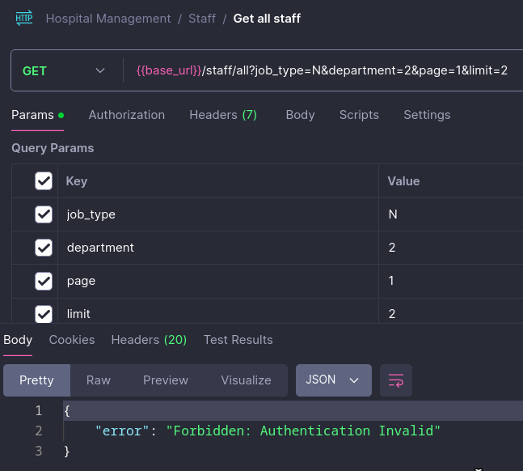

# ISYS2099 Database Application - Group Project - Group 5 - 2024

## Project Overview
This project is part of the ISYS2099 course, where Group 5 has developed a comprehensive hospital management system. The system integrates multiple databases and technologies to manage hospital operations, including patient management, staff management, and appointment scheduling.

## Project Structure

```bash
./
├── app/
│   ├── app.js
│   ├── controllers/
│   ├── databases/
│   ├── middleware/
│   ├── routers/
│   ├── services/
│   └── utils/
├── databases/
│   ├── initDb.js
│   ├── mongo/
│   └── mysql/
├── jsconfig.json
├── package.json
├── package-lock.json
├── README.md
└── tests/
    ├── Hospital Management.postman_collection copy.json
    ├── image.png
    └── README.md
```

**Important directories and files**:
- `.env`: Global environmental variables (e.g., for setting up databases, encryption key).
- `package.json`: This folder contains basic information about the project (e.g., description, scripts, dependencies).
- `databases/`: This folder contains the setup scripts and sample data for MySQL and MongoDB databases. ( See [Installation](#installation) )
- `app/`: This folder typically contains the server's core logic, communicating with the web client via API handling.
  - `middlewares/`, `controllers/`, `routers/`: Handle incoming HTTP requests and responses with REST API design.
  - `databases/`: contains database-related logic, like model definitions or ORM configurations; Not to confused with the identical-named `databases/` above.
- `tests/`: contains the Postman Test Collections for all API endpoints. ( See [Testing](#testing) )
## Technology Stack
**Frontend**: 
  
  

**Backend**: 
  
  
  
  
**Database**:
  
  


### Dependencies 
| Dependency | Version |
| --- | --- |
| NodeJS | 18.19.\* |
| MySQL Community Server | 8.4.\* |
| MongoDB Community Server | 7.0.\* |


## Usage
For full installation and usage instructions of the front-end, please visit [here](https://github.com/tsogp/asm2-database-frtnd)

### Installation
1. Make sure your local server of MySQL and MongoDB is running
2. Clone and Navigate to the project
```sh
git clone https://github.com/G180125/ISYS2099_Group5_2024.git

cd ISYS2099_Group5_2024
```

3. Install dependencies
```sh
npm install
```

4. Initialize Database
```sh
npm run init-db
```

### Usage
1. Make sure your local server of MySQL and MongoDB is running and initialized.
2. Start the server
```sh
npm run app
```

3. The API server now starts listening at port 2099 with the URL below.
```
localhost:2099/hospital_management/api/v1
```

## Testing
### Requirement 
- Postman version v11.10.0

### Setup 
1. Import tests collection `tests/Hospital Management.postman_collection.json`

2. Check if the base URL `{{base_url}}` is available by clicking into the highlighted variable as below picture. If not, set it with a value `localhost:2099/hospital_management/api/v1`


### Usage
- Make sure the API server is running.
- Endpoints are splitted based on funtionaclities (e.g., Authorization, Appointment, Treatments). You can get started with the `Testing Server` test.

 
- Since most of endpoints are protected by auth, relevant account (e.g., admin, staff) should be logged in. Inspect the [routers list](app/routers) for more priviledge details.



## Contributors

| Name                  | Email                      | Score |
|-----------------------|----------------------------|-------|
| Dat Pham Xuan         | s3927188@rmit.edu.vn       | 7     |
| Long Nguyen Vi Phi    | s3904632@rmit.edu.vn       | 7     |
| Huan Nguyen Dang      | s3927467@rmit.edu.vn       | 7     |
| Nhan Truong Vo Thien  | s3929215@rmit.edu.vn       | 7     |
| Pavel Potemkin        | s3963284@rmit.edu.vn       | 7     |

## Video Demo
https://www.youtube.com/watch?v=dQw4w9WgXcQ


