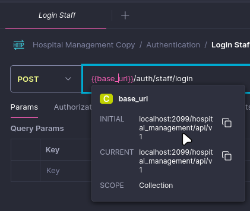

# API Test Suite
Requirement
* Postman v11.10.0

Set up test suite
1. Import endpoint collection `HospitalManagement.postman_collection.json`

2. Check if the base URL `{{base_url}}` is available by clicking into the highlighted variable as below picture. If not, set it with a value `localhost:2099/hospital_management/api/v1`

3. Run program and Enjoy!